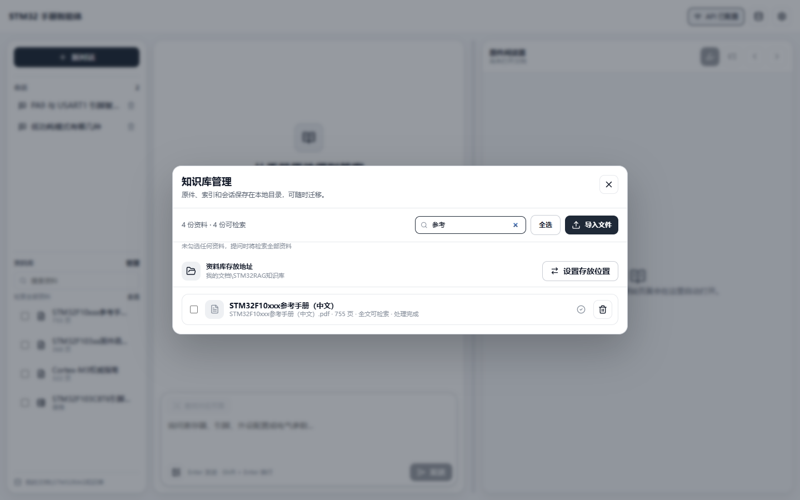
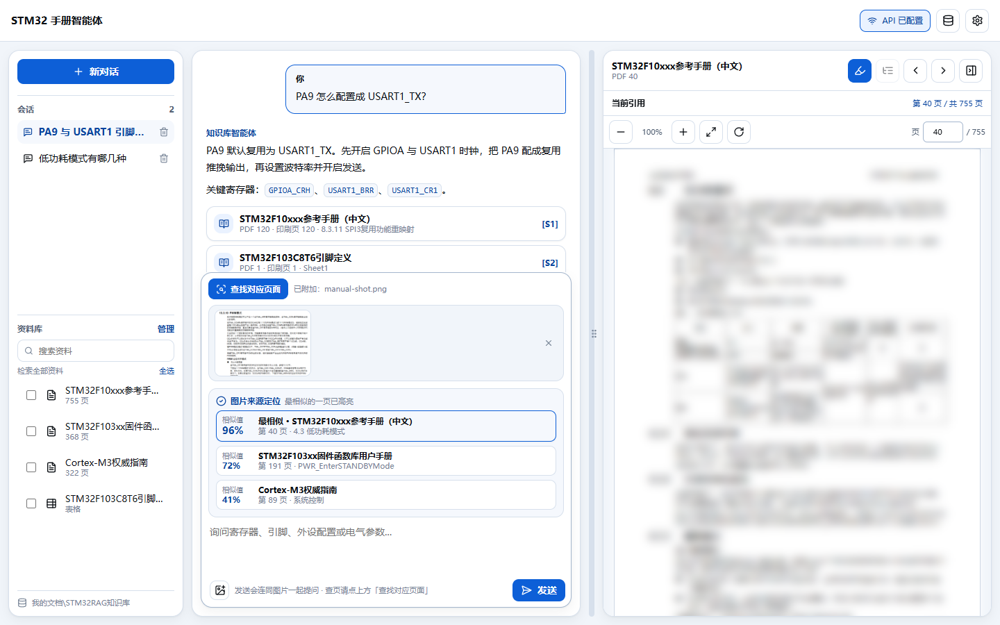
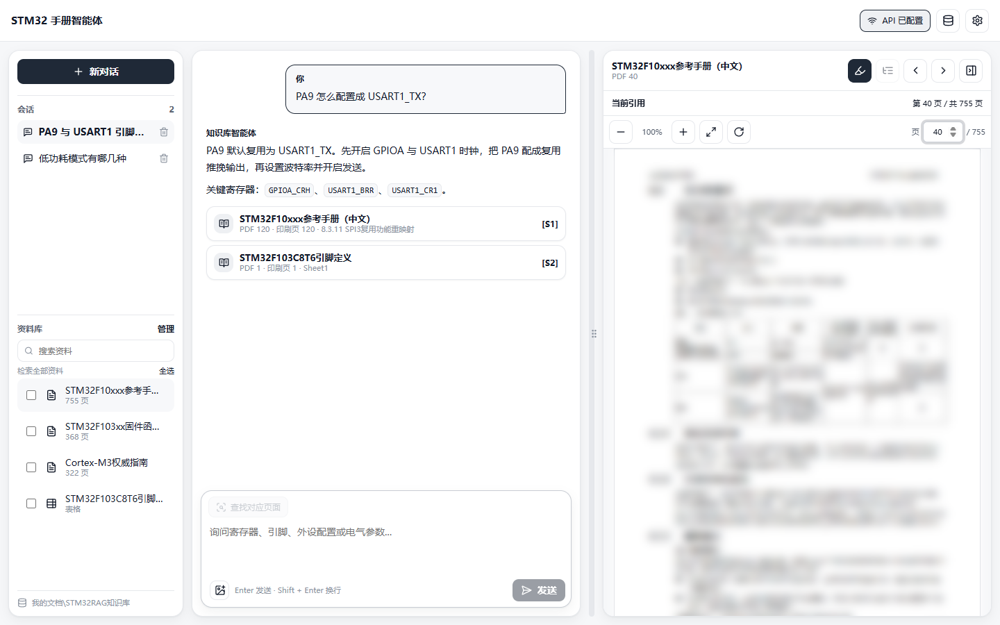

# ManualLens — STM32 手册智能体

[](https://github.com/linx8999/manual-lens/actions/workflows/ci.yml)
[](LICENSE)

**把你手上的 STM32 手册变成可以对话、可以定位的本地知识库。**

导入自己的参考手册、数据手册、固件库手册和引脚表，用中文提问，回答带 `[S#]` 页级引用，
点一下就在右侧内置阅读器打开对应原件页面；也可以直接截一张手册的图丢进来，
让它告诉你这来自哪份资料的哪一页。所有资料、索引和密钥都留在本机。

> 本仓库**不包含任何 STM32 手册原文**，也不包含任何 API 密钥、账号信息或个人路径。
> 手册是第三方版权资料，请使用你自己合法获得的文件。

## 目录

- [界面预览](#界面预览)
- [核心功能](#核心功能)
- [工作原理](#工作原理)
- [系统要求](#系统要求)
- [快速开始](#快速开始)
- [导入你自己的手册](#导入你自己的手册)
- [资料库位置](#资料库位置)
- [配置模型与密钥](#配置模型与密钥)
- [图片定位：截图找页](#图片定位截图找页)
- [隐私与安全](#隐私与安全)
- [项目结构](#项目结构)
- [开发命令](#开发命令)
- [测试](#测试)
- [基准数据](#基准数据)
- [打包与分发](#打包与分发)
- [常见问题](#常见问题)
- [贡献](#贡献)
- [许可证](#许可证)

## 界面预览

内置三套主题：**白色**、**蓝白**、**曜石黑**。下面以亮色主题为主，便于看清细节。

### 白色主题


### 蓝白主题


### 资料库勾选与搜索

每份资料前都有勾选框，支持全选 / 取消全选，并可按名称搜索；勾选后提问只检索这些资料。



### 页级引用回答

回答里每个结论都带 `[S#]`，点击引用右侧直接打开对应页并高亮命中片段。


### 截图定位到页

附加截图后「查找对应页面」按钮才会亮起；结果按相似值排序，最相似的一条高亮标注。



### 设置

模型接口、主题颜色、图片识别引擎都在这里配置，密钥只写入本机加密存储。


### 内置阅读器（原件页面已打码）

真实手册页渲染在右侧阅读器里，引用片段高亮，页面正文已做模糊处理以规避版权。



### 曜石黑主题


> 截图中的数据均为演示用模拟数据，不是真实知识库内容。

## 核心功能

### 知识库

- **导入** PDF / XLSX / XLS / PNG / JPG，逐页提取正文、目录树、页面尺寸与文本坐标。
- **去重**：相同 SHA-256 的文件自动跳过，失败文件不会留下半成品记录。
- **状态可见**：全文可检索 / 仅按文件名检索 / 未提取到可检索文字。
- **勾选过滤**：侧边栏与知识库管理都能逐份勾选、一键全选，提问时只在你勾选的范围内检索（词法检索、向量检索、目录定向三处同步收敛）。
- **资料搜索**：两个列表都有搜索框，按标题或文件名实时筛选，资料多了也能秒定位。
- **位置自由**：资料库可以随时迁移到别的磁盘或文件夹，**代码里没有任何写死的绝对路径**。

### 检索

- **中文双字词索引**：中文按 bigram 建索引，避免单字（低/功/模/式）把 BM25 排名拉平。
- **关键词抽取**：从自然语言提问里剥离疑问词与泛化动词，抽出真正能检索的技术词。
- **领域词表**：中文说法自动映射到寄存器级术语，例如「独立看门狗」→ `IWDG` / `IWDG_PR` / `IWDG_RLR`。
- **多路查询 + RRF 融合**：原始整句、关键词合路、单词关键词、领域扩展各走一路，关键词权重更高。
- **文档频率过滤**：满库出现的样板词（页眉页脚、章名）自动降权或剔除。
- **目录定向**：关键词命中手册目录节点时，该章节起始页显著加权。
- **编号小节加权**：命中「4.3 低功耗模式」这类编号小节标题时强加权。
- **可选向量检索**：配置 embedding 模型后叠加语义检索，覆盖「换个说法问同一件事」。

### 图片定位（截图找页）

- **附加图片不触发检索**：点图片按钮从文件资源管理器选图（或 Ctrl+V 粘贴），图片只是附加进来，不会自动开始查找。
- **两个动作分开**：点「查找对应页面」才做定位；直接发送则把图片作为多模态输入交给模型识别与对话。
- **双引擎**：视觉模型（默认，识别率更高）/ 本机 OCR（Windows 自带，完全离线，截图不出本机）。
- **自动回落**：视觉接口失败或额度用尽时自动改用本机 OCR，功能不会不可用。
- **相似值排序**：返回 Top-8 候选，每条标注相似值，最相似的一条高亮并标注「最相似」。

### 问答

- 支持任意 **OpenAI 兼容**接口，流式输出。
- 回答严格依据检索到的证据，每条结论标注 `[S#]`，证据不足时明确说明。
- 提示词携带**抽取出的关键概念与提问意图**（配置类给步骤、对比类给对比、参数类给数值）。
- 支持**多模态图片对话**：附加截图后直接提问，模型会看图回答。
- 未配置 API 时仍可导入、检索、浏览原件，只是不生成自然语言回答。

### 阅读器

- 内置 PDF.js 连续滚动阅读器：目录跳转、页码输入、缩放、旋转、文本选择。
- 引用页自动打开并高亮命中片段。
- **拖动分栏保持位置**：改变阅读器宽度时，你正在看的那一页和页内位置不会跳动。
- **拖动顺滑**：拖动期间只走 rAF + CSS 变量（不触发 React 重渲染）、只做合成层预览（不重新光栅化 PDF）、
  并对 700+ 页面栈做布局隔离（`contain: layout paint`），松手才真正重绘一次。
- 支持 XLSX 表格原件与图片原件查看。

### 交互

- 三套主题：白色 / 蓝白 / 曜石黑；深色主题下原生标题栏同步变深。
- 面板、引用卡、设置分组统一为圆角卡片，颜色克制。
- 输入框随内容自动增高，最高 220px 后内部滚动。

## 工作原理

```
                        ┌─────────────── 导入 ───────────────┐
PDF / XLSX / 图片  ──►  逐页文本 + 目录树 + 页面尺寸  ──►  SQLite
                        (pages / toc_nodes / chunks / chunks_fts)
                                    │
                                    │ 中文 bigram + 标识符索引
                                    ▼
提问 ──► 关键词抽取 + 领域词表 ──► 多路查询 ──► 文档频率过滤
                                    │
                                    ▼
        BM25 + 覆盖率 + 短语命中 + 编号小节命中 + 目录定向 ──► RRF 融合
                                    │
                          勾选的资料范围过滤
                                    │
                                    ▼
                        Top-N 证据 ──► 提示词（含关键概念与提问意图）
                                    │
                                    ▼
                     模型 ──► 带 [S#] 页级引用的回答 ──► 阅读器打开对应页


截图 ──► 视觉模型转录（或本机 Windows OCR）
     ──► 中文 bigram + IDF 加权评分（在勾选范围内逐页比）
     ──► Top-8 候选（标注相似值，第一名高亮）
```

细节见 [docs/ARCHITECTURE.md](docs/ARCHITECTURE.md)（架构与数据模型）与
[docs/RETRIEVAL.md](docs/RETRIEVAL.md)（检索与打分细节）。

## 系统要求

- Node.js 22.5 或更高（仅开发需要，最终用户装安装包不需要）。
- Windows 10/11（推荐，密钥用 DPAPI 加密）、macOS、Linux。
- 本机 OCR 引擎为 Windows 自带，仅 Windows 可用；其他平台用视觉模型即可。
- 磁盘空间：应用约 250 MB，知识库取决于你导入的手册体积。

## 快速开始

```powershell
git clone https://github.com/linx8999/manual-lens.git
cd manual-lens
npm install
npm run dev
```

打包成安装包：

```powershell
npm run dist:win      # 产物在 release/
```

首次启动知识库是空的，先导入你自己的手册。

## 导入你自己的手册

**方式一：应用内导入（推荐）**

1. 点右上角资料库图标 → 「导入文件」，可多选 PDF / XLSX / 图片。
2. 等状态变成「全文可检索」即可开始提问。

**方式二：批量导入（开发时）**

1. 把手册放进 `resources/library/`（该目录已被 `.gitignore` 忽略）。
2. 复制清单模板并填写：

   ```powershell
   Copy-Item resources\library-manifest.json resources\library-manifest.local.json
   ```

   ```json
   [
     {
       "title": "STM32F10xxx 参考手册（中文）",
       "sourcePath": "library/STM32F10xxx参考手册（中文）.pdf",
       "kind": "pdf"
     }
   ]
   ```

   `kind` 取 `pdf` / `xlsx` / `image`；`sourcePath` 相对于清单文件所在目录。

3. 导入：

   ```powershell
   npm run seed -- --data-root="D:\STM32RAG知识库"
   ```

> 公开的 `resources/library-manifest.json` 是空数组，保证不会泄露你的手册清单。

### 解析能力

- 带文本层的 PDF：逐页正文 + 目录树 + 页面尺寸 + 文本坐标。
- XLS/XLSX：按工作表提取单元格。
- 图片：按文件名与标题建立元数据索引（不做 OCR）。
- 没有文本层的扫描 PDF 会标记为「未提取到可检索文字」，需要先自行 OCR。

## 资料库位置

**代码里没有任何写死的绝对路径**，解析顺序：

1. 环境变量 `STM32_RAG_DATA_ROOT`（测试/自动化用）。
2. `%APPDATA%\com.local.stm32rag\data-location.json` 里记录的用户选择。
3. 默认：当前用户**文档目录**下的 `STM32RAG知识库`。

应用内随时迁移：知识库管理 → **设置存放位置** → 选文件夹 → 确认（会先显示目标路径）→ 复制数据并自动重启。
旧目录不会删除，确认后可自行清理。

## 配置模型与密钥

「设置」里分别配置聊天模型与向量模型：

| 项 | 说明 |
|---|---|
| Base URL | OpenAI 兼容地址，例如 `https://api.openai.com/v1` |
| 模型名称 | 可点「获取」自动拉取可用模型 |
| API Key | 只写入本机加密存储，不进入代码、日志或仓库 |
| 图片识别引擎 | 视觉模型（默认）/ 本机 OCR，见下一节 |

密钥存储：Windows 使用 Electron `safeStorage`（DPAPI）加密后写入资料库目录的 `secret.bin`；
设置界面只显示「已配置 / 未配置」，永不回显完整密钥。
**仓库里没有任何默认 URL 与密钥。**

## 图片定位：截图找页

典型用法：你在看教学视频，视频里翻到手册某一页要你去看，你截个图丢进来，让它告诉你这是哪份资料的哪一页。

1. 点输入框左下角的图片按钮（打开文件资源管理器），或直接 **Ctrl+V 粘贴截图**。
2. 图片只是附加进来，**不会自动开始查找**；此时「查找对应页面」按钮从灰色变为高亮。
3. 想做定位 → 点「**查找对应页面**」：在**你勾选的资料范围**内匹配，命中后右侧阅读器直接打开该页，
   并列出 Top-8 候选，每条标注**相似值**，最相似的一条高亮标「最相似」。
4. 想让模型看图回答 → 直接输入问题按 Enter（也可以只发图，会自动补一句"请识别并说明这张图片的内容"）。

两种识别引擎：

| 引擎 | 说明 | 截图是否出本机 |
|---|---|---|
| 视觉模型（默认） | 调用你配置的多模态聊天接口逐字转录，识别率更高 | 会发送到该接口 |
| 本机 OCR | Windows 自带 `Windows.Media.Ocr`，离线运行 | 不出本机 |

视觉调用失败（断网、额度、接口报错）会自动回落到本机 OCR。
定位链路实现在 `src/main/vision/`：`vision-ocr.ts`（多模态转录）、`ocr-service.ts`（本机 OCR）、
`image-matcher.ts`（中文 bigram + IDF 加权评分）。

## 隐私与安全

- 所有手册、索引、会话、设置都保存在本机资料库目录，不上传任何服务器。
- 提问时只把**检索到的少量证据片段**发给你自己配置的接口。
- 图片定位在**视觉模式**下会把截图发给你配置的接口；不想外传就切到「本机 OCR」。
- 仓库不包含：任何手册原文、任何 API Key、任何个人路径、任何会话数据。
- `.gitignore` 已排除 `data/`、`resources/library/`、`resources/library-manifest.local.json`、`artifacts/`。

发布自己的分支前建议自查：

```powershell
git status --short
rg -n "sk-[A-Za-z0-9]{16,}" .
rg -n "C:\\Users\\" .
```

## 项目结构

```
src/
  main/                     Electron 主进程
    api/                    OpenAI 兼容客户端、流式解析、密钥脱敏
    chat/                   会话存储、提示词构建、引用解析
    config/                 资料库路径解析与迁移
    ingestion/              PDF / XLSX / 图片提取、分块、分词、清单
    ipc/                    IPC 白名单注册
    library/                资料读取、目录、原件读取
    search/                 关键词检索、领域词表、目录索引、RRF、重排、向量检索
    security/               密钥存储
    services/               应用服务装配
    storage/                SQLite 表结构、设置、数据访问
    vision/                 截图定位：多模态转录 / 本机 OCR / 页面匹配
  preload/                  contextBridge 白名单 API
  renderer/                 React 界面
    src/components/         会话、问答、设置、资料库、阅读器、输入框
    src/lib/                布局、PDF 定位、输入框高度、图片预处理
  shared/                   主进程与渲染进程共享的类型与常量
tests/                      unit / integration / e2e / helpers
docs/                       架构、检索、部署文档与截图
scripts/                    构建、图标、截图、检索与图片定位基准
```

## 开发命令

| 命令 | 说明 |
|---|---|
| `npm install` | 安装依赖 |
| `npm run dev` | 开发环境（Electron + Vite HMR） |
| `npm run build` | 编译主进程 / preload / 渲染进程到 `out/` |
| `npm run typecheck` | TypeScript 全量类型检查 |
| `npm test` | Vitest 单测与集成测试 |
| `npm run test:e2e` | Playwright + Electron 端到端（需要本地手册） |
| `npm run dist:win` | 生成 Windows NSIS 安装包到 `release/` |
| `npm run seed -- --data-root=<dir>` | 按清单批量导入本地手册 |
| `node scripts/capture-themes.mjs` | 生成主题与状态截图 |
| `node scripts/capture-readme-shots.mjs` | 生成 README 用截图（亮色为主） |

## 测试

```powershell
npm run typecheck
npm test
```

测试分两类：

1. **不依赖手册**（默认全部运行）：分词、关键词抽取、领域词表、OCR 文本归一化、RRF 融合、重排、
   滚动换算、设置持久化、IPC 契约等。
2. **依赖真实手册**：PDF/XLSX 提取、导入去重、页级检索、端到端导入问答。
   仓库不携带手册，因此**没有语料时自动跳过**，不会让 `npm test` 变红。

本机启用第二类，满足任一条件即可：`resources/library/` 里有对应文件、或提供
`resources/library-manifest.local.json`、或用 `STM32_RAG_CORPUS_DIR` 指向你的手册目录。

## 基准数据

```powershell
npx tsx scripts/check-extraction.ts                       # 逐页解析覆盖率
npx tsx scripts/check-retrieval.ts artifacts/bench-data   # 建基准库
npx tsx scripts/smoke-retrieval.ts artifacts/bench-data   # 95 题检索冒烟
node scripts/render-page-shots.mjs                        # 渲染 50 张页面截图
npx tsx scripts/transcribe-shots.mjs <资料库目录>          # 视觉引擎转录
npx tsx scripts/check-image-match.ts artifacts/bench-data # 图片定位准确率
npx tsx scripts/check-scope-filter.ts artifacts/bench-data# 勾选范围是否严格生效
```

实测结果（完整参考手册语料）：

| 指标 | 结果 |
|---|---|
| 页面文本解析覆盖率 | ≥97.5%（除扫描页外全部 100%） |
| 问答检索：手写真实问法 | 51 / 51 |
| 问答检索：目录自动生成章节问题 | 41 / 44 |
| 问答检索：合计 | 92 / 95（96.8%） |
| 图片定位：视觉模型（50 张不同裁切/压缩截图） | **48 / 50 = 96.0%** |
| 图片定位：本机 OCR（同一批截图） | 45 / 50 = 90.0% |
| 勾选范围过滤 | 勾选后结果 100% 来自所选资料，越界 0 条 |

> 图片定位的 2 个未命中样本，裁切区域本身是空白/图形页，没有文字可供识别。

## 打包与分发

```powershell
npm run dist:win
```

- 产物：`release/STM32 手册智能体-Setup-<version>.exe`（NSIS，可选安装目录）。
- 安装包**不包含任何手册**，首次使用请自行导入。
- 详细部署说明见 [docs/DEPLOYMENT.md](docs/DEPLOYMENT.md)。

## 常见问题

**启动后知识库是空的？**
仓库不携带手册。先导入你自己的 PDF/XLSX，或按「批量导入」填写本地清单。

**桌面快捷方式打开的还是旧界面？**
快捷方式指向安装版。改完代码要 `npm run dist:win` 重新打包并覆盖安装；只跑 `npm run build` 不会更新已安装的应用。开发期用 `npm run dev` 直接看最新代码。

**提问提示「未找到足够相关的资料」？**
确认资料状态是「全文可检索」；扫描版 PDF 需要 OCR。也可以配置 embedding 模型并重建向量索引，语义检索会显著改善「换了说法」的提问。

**截图定位不准？**
确认在设置里选的是「视觉模型」引擎；截图里最好有正文文字（纯图/空白页无法定位）。也可以只勾选可能相关的那几份资料，范围越聚焦越准。

**想让模型直接看图回答？**
附加图片后**不要**点「查找对应页面」，直接在输入框提问按 Enter 即可；只发图不打字也行。

**密钥会被上传吗？**
不会。密钥只在本机加密存储；提问时只发送检索到的证据片段，图片定位在视觉模式下才会发送截图。

## 贡献

欢迎 Issue 与 PR，请先阅读 [CONTRIBUTING.md](CONTRIBUTING.md)。

## 许可证

[MIT](LICENSE)

> 本项目不附带任何 STM32 手册、数据手册或厂商文档。导入的第三方资料版权归各自权利人所有，
> 请确保你有权使用。
