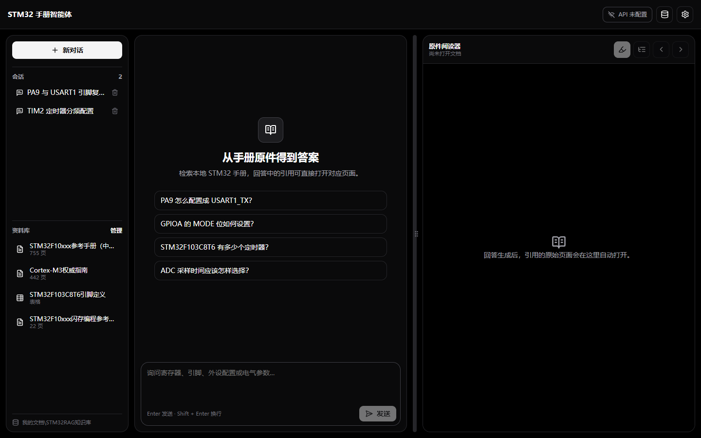
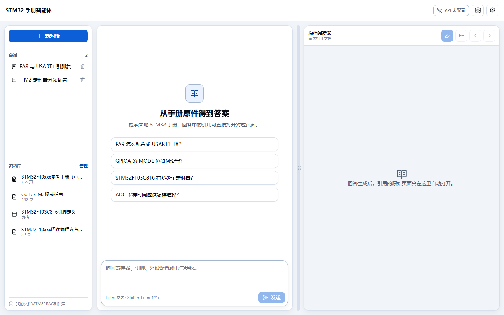
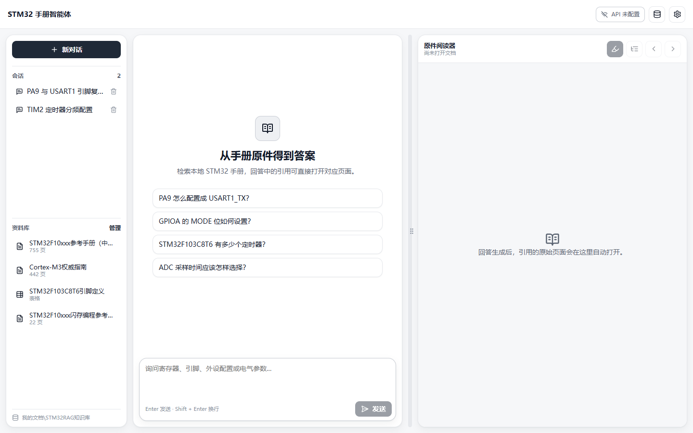
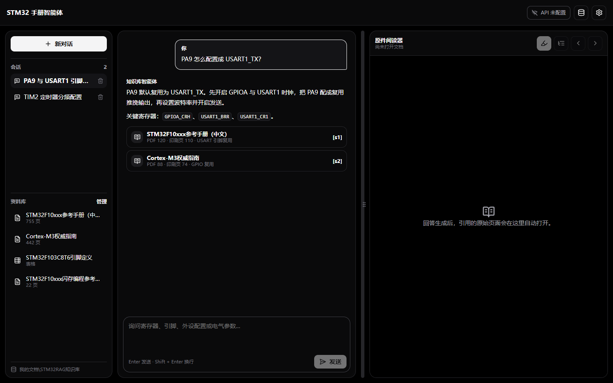
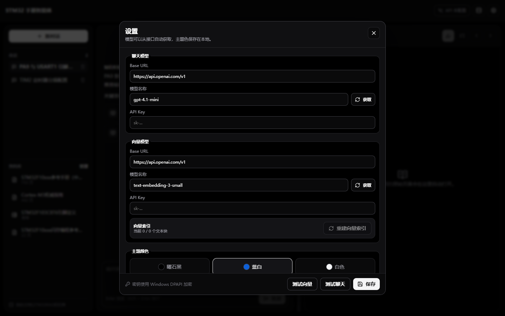

# STM32 手册智能体

[](https://github.com/linx8999/stm32-manual-agent/actions/workflows/ci.yml)
[](LICENSE)

一个跨平台桌面端的**本地优先** STM32 手册知识库智能体。把你自己手上的 STM32 参考手册、
数据手册、固件库手册、引脚表导入到本机，用自然语言提问，回答会带上 `[S#]` 页级引用，
点击即可在右侧内置阅读器里打开对应原件页面。

> 本仓库**不包含任何 STM32 手册原文**，也不包含任何 API 密钥、账号信息或个人路径。
> 手册是第三方版权资料，请使用你自己合法获得的文件。

## 目录

- [界面预览](#界面预览)
- [主要特性](#主要特性)
- [工作原理](#工作原理)
- [系统要求](#系统要求)
- [快速开始](#快速开始)
- [导入你自己的手册](#导入你自己的手册)
- [知识库存放位置](#知识库存放位置)
- [配置模型与密钥](#配置模型与密钥)
- [隐私与安全](#隐私与安全)
- [项目结构](#项目结构)
- [开发命令](#开发命令)
- [测试](#测试)
- [检索质量基准](#检索质量基准)
- [打包与分发](#打包与分发)
- [常见问题](#常见问题)
- [贡献](#贡献)
- [许可证](#许可证)

## 界面预览

内置三套主题：曜石黑（纯黑白）、蓝白、白色。面板、引用卡片、设置分组统一为圆角卡片样式。

**曜石黑**



**蓝白**



**白色**



**带页级引用的回答**



**设置（主题、模型、向量索引）**



> 截图中的数据为演示用模拟数据，不是真实知识库内容。

## 主要特性

### 知识库

- 导入 PDF / XLSX / XLS / PNG / JPG，逐页提取文本、目录和页面尺寸。
- 相同 SHA-256 的文件自动去重，失败文件不会留下半成品记录。
- 资料库可以随时迁移到其他磁盘或文件夹，旧目录保留不删除。
- 状态可见：全文可检索 / 仅按文件名检索 / 未提取到可检索文字。
- **资料库位置不写死任何路径**：默认落在当前用户的文档目录，可自由更改。
- **资料库勾选过滤**：每份资料都能单独勾选，支持全选 / 取消全选，并可在资料栏按名称搜索；不勾选任何资料时检索全部，勾选后提问只检索这些资料（词法检索、向量检索、目录定向三处都按范围收敛）。
- **截图定位页面**：在输入框附加截图（文件资源管理器选择或 Ctrl+V 粘贴），点「查找对应页面」即可定位到手册的具体页并在阅读器打开；**不点这个按钮时，截图会作为多模态输入直接交给模型识别与对话**。

### 图片定位

| 引擎 | 说明 | 实测平均命中率 |
|---|---|---|
| 视觉模型（默认） | 截图发送到已配置的多模态聊天接口做逐字转录 | **96%**（50 张真实页面截图） |
| 本机 OCR | Windows 自带 `Windows.Media.Ocr`，离线、截图不出本机 | 90%（同一批截图） |

定位链路：截图 → 转录文本 → 中文 bigram + IDF 加权把文本匹配到页 → 返回 Top-8 候选（第一名高亮并标注相似值）。
视觉接口失败时自动回落到本机 OCR，功能不会因为断网或额度用尽而不可用。
相关实现见 `src/main/vision/`（`vision-ocr.ts` / `ocr-service.ts` / `image-matcher.ts`）。

### 检索

- **中文双字词索引**：中文按 bigram 建索引，避免单字（低/功/模/式）淹没 BM25 排名。
- **关键词抽取**：从自然语言提问里剥离疑问词与泛化动词，抽出真正能检索的技术词。
- **领域词表**：中文说法自动映射到寄存器级术语（独立看门狗 → `IWDG` / `IWDG_PR` / `IWDG_RLR`）。
- **多路查询 + RRF 融合**：原始整句、关键词合路、单词关键词、领域扩展各走一路，关键词权重更高。
- **文档频率过滤**：满库都是的词自动降权，避免噪声词主导排序。
- **目录定向**：关键词命中手册目录节点时，该章节起始页会被显著加权。
- **编号小节加权**：命中「4.3 低功耗模式」这类编号小节标题时强加权。
- **可选向量检索**：配置 embedding 模型后可叠加语义检索，覆盖「换个说法问同一件事」。

### 问答

- OpenAI 兼容的 Chat Completions 接口，流式输出。
- 回答严格依据检索到的证据，每条结论标注 `[S#]`，证据不足时明确说明。
- 提示词会根据提问意图调整（配置类给步骤、对比类给对比、参数类给数值）。
- 未配置 API 时仍然可以导入、检索、浏览原件，只是不生成自然语言回答。

### 阅读器

- 内置 PDF.js 连续滚动阅读器，支持目录跳转、页码输入、缩放、旋转、文本选择。
- 引用页自动打开并高亮命中片段。
- 拖动分栏改变阅读器宽度时，**保持你正在看的那一页与页内位置**不跳动。
- 支持 XLSX 表格原件与图片原件查看。

### 交互

- 三套主题：曜石黑（纯黑白）、蓝白、白色。
- 圆角卡片式布局，深色主题下原生标题栏同步变深。
- 输入框随内容自动增高，最高 220px 后内部滚动。

## 工作原理

```
PDF / XLSX / 图片
      │  ① 导入
      ▼
页级文本 + 目录 + 页面尺寸  ──►  SQLite（pages / toc_nodes / chunks / chunks_fts）
      │  ② 索引（中文 bigram + 标识符）
      ▼
提问 ──► ③ 关键词抽取 + 领域词表 + 多路查询
      │
      ▼
BM25 + 覆盖率 + 短语命中 + 编号小节命中 + 目录定向 + RRF 融合
      │
      ▼
Top-N 证据 ──► ④ 提示词（携带关键概念与提问意图）──► 模型 ──► 带 [S#] 引用的回答
```

细节见 [docs/ARCHITECTURE.md](docs/ARCHITECTURE.md) 与 [docs/RETRIEVAL.md](docs/RETRIEVAL.md)。

## 系统要求

- Node.js 20 或更高版本（仅开发时需要，最终用户安装包不需要）。
- npm 10 或更高版本。
- Windows 10/11（推荐，密钥使用 DPAPI 加密）、macOS、Linux。
- 磁盘空间：应用约 250 MB，知识库取决于你导入的手册体积。

## 快速开始

```powershell
git clone https://github.com/linx8999/stm32-manual-agent.git
cd stm32-manual-agent
npm install
npm run dev
```

打包成安装包：

```powershell
npm run dist:win      # 输出到 release/
```

首次启动时知识库是空的，需要先导入你自己的手册。

## 导入你自己的手册

**方式一：在应用内导入（推荐）**

1. 点击右上角的资料库图标打开「知识库管理」。
2. 点击「导入文件」，选择你的 PDF / XLSX / 图片，可多选。
3. 等待解析完成，状态会变为「全文可检索」。

**方式二：批量导入（开发时）**

1. 把你的手册放进 `resources/library/`（该目录已被 `.gitignore` 忽略，不会被提交）。
2. 复制模板并填写你自己的清单：

   ```powershell
   Copy-Item resources\library-manifest.json resources\library-manifest.local.json
   ```

   `resources/library-manifest.local.json` 的格式：

   ```json
   [
     {
       "title": "STM32F10xxx 参考手册（中文）",
       "sourcePath": "library/STM32F10xxx参考手册（中文）.pdf",
       "kind": "pdf"
     }
   ]
   ```

   `kind` 可选 `pdf` / `xlsx` / `image`，`sourcePath` 相对于清单文件所在目录。

3. 指定资料库目录并导入：

   ```powershell
   npm run seed -- --data-root="D:\STM32RAG知识库"
   ```

> `resources/library-manifest.local.json` 同样被 `.gitignore` 忽略，不会随仓库发布。
> 仓库中公开的 `resources/library-manifest.json` 是空数组，保证不会泄露任何手册清单。

### 解析能力

- 带文本层的 PDF：逐页提取正文、目录树、页面尺寸与文本坐标。
- XLS/XLSX：按工作表提取单元格。
- 图片：按文件名与标题建立元数据索引（不做 OCR）。
- 没有文本层的扫描版 PDF 会被标记为「未提取到可检索文字」，需要先自行 OCR。

## 知识库存放位置

**代码里没有任何写死的绝对路径。** 解析顺序如下：

1. 环境变量 `STM32_RAG_DATA_ROOT`（测试/自动化用）。
2. `%APPDATA%\com.local.stm32rag\data-location.json` 中记录的用户选择。
3. 默认值：当前用户**文档目录**下的 `STM32RAG知识库`。

应用内随时可以迁移：

知识库管理 → **设置存放位置** → 选择文件夹 → 确认（会先展示目标路径）→ 应用复制数据并自动重启。
旧目录不会被删除，确认后可以自行清理。

> 迁移时会在你选择的文件夹内创建固定的子目录 `STM32RAG知识库`，避免把数据和你其他文件混在一起。

## 配置模型与密钥

在「设置」里分别配置聊天模型与向量模型：

| 项 | 说明 |
|---|---|
| Base URL | OpenAI 兼容地址，例如 `https://api.openai.com/v1` |
| 模型名称 | 可点「获取」自动拉取可用模型 |
| API Key | 只写入本机加密存储，不进入代码、日志或仓库 |

密钥存储方式：

- Windows：Electron `safeStorage`（DPAPI），密钥以密文写入资料库目录下的 `secret.bin`。
- 其他平台：使用 Electron 支持的系统密钥链；不可用时降级为本地文件并给出提示。
- 设置界面只显示「已配置 / 未配置」，永远不回显完整密钥。

**仓库里没有任何默认 URL 与密钥**，`settings.json` 只存在于你的资料库目录，且已被 `.gitignore` 忽略。

## 隐私与安全

- 所有手册、索引、会话记录、设置都保存在你本机的资料库目录，不上传到任何服务器。
- 只有在提问时，才会把**检索到的少量证据片段**发送给你自己配置的模型服务。
- 仓库不包含：任何手册原文、任何 API Key、任何个人路径、任何会话数据。
- `.gitignore` 已排除 `data/`、`resources/library/`、`resources/library-manifest.local.json`、`artifacts/`。
- 迁移或删除资料库前请自行备份，程序不会自动删除旧目录。

发布自己的分支前建议自查：

```powershell
git status --short
rg -n "sk-[A-Za-z0-9]{16,}" .            # 不应有输出
rg -n "C:\\Users\\<你的用户名>" .        # 不应有输出
```

## 项目结构

```
src/
  main/                     Electron 主进程
    api/                    OpenAI 兼容客户端、流式解析、密钥脱敏
    chat/                   会话存储、提示词构建、引用解析
    config/                 资料库路径解析与迁移
    ingestion/              PDF / XLSX / 图片提取、分块、分词、清单
    ipc/                    IPC 白名单注册
    library/                资料读取、目录、原件读取
    search/                 关键词检索、领域词表、目录索引、RRF、重排、向量检索
    security/               密钥存储
    services/               应用服务装配
    storage/                SQLite 表结构、设置、数据访问
  preload/                  contextBridge 白名单 API
  renderer/                 React 界面
    src/components/         会话、问答、设置、资料库、阅读器
    src/lib/                布局、PDF 定位、输入框高度等纯函数
  shared/                   主进程与渲染进程共享的类型与常量
tests/
  unit/                     纯函数与组件单测
  integration/              导入、检索、持久化集成测试
  e2e/                      Playwright + Electron 端到端用例
docs/
  ARCHITECTURE.md           架构与数据模型
  RETRIEVAL.md              检索管线与调优方法
  DEPLOYMENT.md             部署、打包、迁移
scripts/                    构建、图标、截图、检索基准等开发脚本
```

## 开发命令

| 命令 | 说明 |
|---|---|
| `npm install` | 安装依赖 |
| `npm run dev` | 启动开发环境（Electron + Vite HMR） |
| `npm run build` | 编译主进程 / preload / 渲染进程到 `out/` |
| `npm run typecheck` | TypeScript 全量类型检查 |
| `npm test` | 运行 Vitest 单测与集成测试 |
| `npm run test:e2e` | 构建后运行 Playwright 端到端用例（需要本地手册） |
| `npm run dist:win` | 生成 Windows NSIS 安装包到 `release/` |
| `npm run seed -- --data-root=<dir>` | 按清单批量导入本地手册 |
| `node scripts/capture-themes.mjs` | 生成三套主题与关键状态截图到 `artifacts/` |

## 测试

```powershell
npm run typecheck
npm test
```

测试分成两类：

1. **不依赖手册的测试**（默认全部运行）：分词、关键词抽取、领域词表、RRF 融合、重排、
   设置持久化、阅读器滚动换算、IPC 契约等。
2. **依赖真实手册的测试**：PDF/XLSX 提取、导入去重、页级检索、端到端导入问答。
   仓库不携带手册，因此**没有语料时会自动跳过**，不会导致 `npm test` 失败。

要在本机启用第二类测试，让下面任一条件成立即可：

- `resources/library/` 中存在对应文件；或
- 提供 `resources/library-manifest.local.json` 列出你的手册；或
- 用 `STM32_RAG_CORPUS_DIR` 指向你的手册目录。

## 检索质量基准

仓库内置可复现的检索冒烟测试，用「手写真实问法 + 从手册目录自动生成的章节问题」评测命中率：

```powershell
# 1. 建基准库（首次导入本地手册，之后复用）
npx tsx scripts/check-retrieval.ts artifacts/bench-data

# 2. 跑冒烟测试（默认 95 个问题）
npx tsx scripts/smoke-retrieval.ts artifacts/bench-data

# 3. 统计页面文本解析覆盖率
npx tsx scripts/check-extraction.ts
```

当前实测（完整参考手册语料）：

| 指标 | 结果 |
|---|---|
| 页面文本解析覆盖率 | ≥97.5%（除扫描页外全部 100%） |
| 手写真实问法命中率 | 51 / 51 |
| 目录自动生成章节问题命中率 | 41 / 44 |
| 合计 | 92 / 95（96.8%） |

## 打包与分发

```powershell
npm run dist:win
```

- 产物：`release/STM32 手册智能体-Setup-<version>.exe`（NSIS，可选安装目录）。
- 安装包**不包含任何手册**，首次使用请自行导入。
- 安装后资源位于 `%LOCALAPPDATA%\Programs\stm32-rag-desktop`。
- 详细部署说明见 [docs/DEPLOYMENT.md](docs/DEPLOYMENT.md)。

## 常见问题

**Q：为什么启动后知识库是空的？**
仓库不携带手册。请先导入你自己的 PDF/XLSX，或按「批量导入」填写本地清单。

**Q：桌面快捷方式打开的还是旧界面？**
快捷方式指向安装版。改完代码后需要 `npm run dist:win` 重新打包并覆盖安装；
只跑 `npm run build` 不会更新已安装的应用。开发期用 `npm run dev` 可直接看到最新代码。

**Q：提问后提示「未找到足够相关的资料」？**
确认资料状态是「全文可检索」；扫描版 PDF 需要 OCR。也可以在设置里配置 embedding 模型并
重建向量索引，语义检索会显著改善「换了说法」的提问。

**Q：密钥会被上传吗？**
不会。密钥只保存在本机加密存储中，提问时只会把检索到的证据片段发给你配置的模型服务。

## 贡献

欢迎提交 Issue 与 Pull Request，请先阅读 [CONTRIBUTING.md](CONTRIBUTING.md)。

## 许可证

[MIT](LICENSE)

> 本项目不附带任何 STM32 手册、数据手册或厂商文档。导入的第三方资料版权归各自权利人所有，
> 请确保你有权使用。
